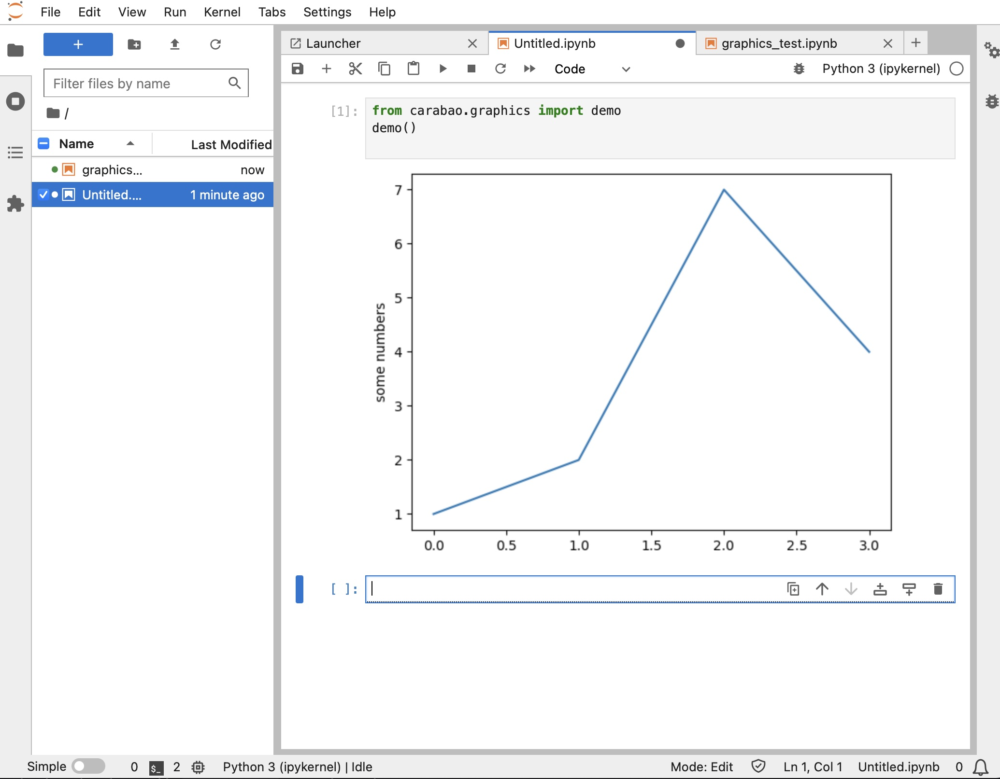

# Neurotron Development


## Neurotron

_A neural computing unit mimicing an abstraction of a biological pyramidal
neuron or a biological microcircuit arround a pyramidal neuron._


## Markdown Language for Documentation

This `README.md` file is written using easy-to-learn `Markdown` for text
formatting, hyperlink support, image embedding, and more. You can visit
[Github-flavored Markdown](https://guides.github.com/features/mastering-markdown/)
for a `markdown` crashcourse.

On macOS we recommend [MacDown](https://macdown.uranusjr.com) as markdown editor,
but many editors (like Atom) do the job as well.

## Tools

For efficient work we need the following tools

* git
* github desktop
* python
* pip
* make
* virtual environments
* jupyter lab
* colab

## Getting Started

Before we go through the mentioned tools in detail we explain how you get started.

* Make sure that [git](https://git-scm.com) and [Github Desktop](https://docs.github.com/en/desktop/installing-and-authenticating-to-github-desktop/installing-github-desktop) is installed on your computer, otherwise install these tools (follow the hyper links).

* We recommend the following file tree structure when working with `git
  repositories` (`repositories` or `repos` are the file packages being managed
  by git, which can be accessed on `github` by unique URLs):

```
└── git
    ├── repo-group1
    │   ├── repoA
    │   ├── repoB
    │   └── tmp
    ├── repo-group2
    │   ├── repoK
    │   ├── repoL
    │   ├── repoM
    │   └── tmp
    :
    ├── repo-groupN
    │   ├── repoX
    │   ├── repoY
    │   ├── repoZ
    │   └── tmp
```

This recommendation suggests a central root directory which you can give any name
(we name it `git`), under the root directory we arrange repository group
directories (`repo-group1`, `repo-group2`, ..., `repo-groupN`), and under each
repository group we install several repositories plus an optional `tmp` folder,
where we can store local copies for easy comparison.

In our case we choose the name `neural` for the repository group name, and are
going now to do the following preparations (utilizing a bash shell in a terminal
window):

```
   $ mkdir path-to/git       # the root directory of all our repos
   $ cd path-to/git          # cd into our repo root
   $ mkdir neural            # the group directory of all our `neural repos`
   $ cd neural               # cd into group directory
```

With current directory changed to our repo group `path-to/git/neural` we clone
our first repository from github by invoking:

```
   $ git clone https://github.com/ihux/carabao-utils.git
```

This creates a folder named `carabao-utils` (same name as the git repo) in our group folder and leaves us with the following directory structure:

```
└── git
    └── neural
        └── carabao-utils
```

You are free to choose your own names for the `git` and `neural` folder name, but we recommend not to change the name of the repository folder (`carabao-utils`), even you might do so. The 'tmp' folder can be added any time when there is need.


## Dot Go - Access Provided Command Line Utilities

The repository comes also with some local utilities for your work in the command
line, which are partly provided as aliases referring to bash scripts located in
`./local/bin`. To activate them type the `dot go` command:

```
   $ . go     # notice the space between . and go (alternatively: source go)
```

After invoking the `go` script you can type

```
   $ ?        # type ? for quick help
```

## Creating and Activating a Virtual Python Environment

```
   $ make venv                  # create virtual python environment
   $ source venv/bin/activate   # activate venv (short form: $ ve)
   (venv) $
```

To deactivate the virtual python environment, type

```
   (venv) $ deactivate          # deactivate venv (short form: $ de)
```

Since the following steps should do all modifications in our virtual python
environment we need to reactivate it again. The string `(venv)` before the
command line prompt indicates that the environment has been activated.

```
   $ source venv/bin/activate   # activate venv (short form: $ ve)
   (venv) $
```


## Install python packages

In our created virtual python environment we will install several python
packages which we frequently use in the following.

```
   (venv) $ make install
```

## Build and Install Carabao Utilities

With the python libraries installed (and the virtual python environment still
activated we build and install the Carabao Utilities)

```
   (venv) $ make carabao
```

## Test Python Environment in Jupyter Lab

Now we are ready to test our python working environment in Jupyter Lab

```
   (venv) $ jupyter lab         # launch jupyter lab
```

From the top menu bar select `File/New/Notebook` to create a new jupyter
notebook. Type the following code into the code cell:

```
   from carabao.graphics import demo
   demo()
```

Congrats, if you see the graphics below - you are ready to go.

<p align="center">
  
</p>


# Tools

## Git

`Git` is a version control system that allows developers to track a project and
actively contribute without interfering in each other’s work. `git` should be
pre-installed on recent macOS systems. If not, get instructions from the
official `git` web site https://git-scm.com. With an installed `git` you can use
the full function set of `git` from the command line.

## Github Desktop

While `git` is the tool to perform version control, we have `github` as a cloud
site to backup the local data on a remote site.
[Github Desktop](https://docs.github.com/en/desktop/installing-and-authenticating-to-github-desktop/installing-github-desktop) is an easy-to-use graphical tool around `git`
which performs the `git` operations on mouse click.
